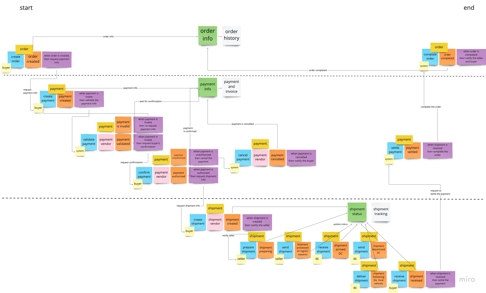

# Event Sourcing Order P.O.C
## Event Stream

    
## Code Structure
#### Dependency Services
- Kafka: Event Store & Event Bus
#### Domain Aggregate
- Order
- Payment
- Shipment
#### Server Role
- Command-Side: 
  - handle command request 
  - write events to Kafka
- Query-Side: 
  - consume events from Kafka to build data view
  - return query request
- Event-Handler
  - consume events from Kafka to send command request to Command-side

## How to run application

The dependency container will run in the docker by `spring-boot-docker-support`
so you can run the App by IDE directly.


## Run E2E test in local

### prerequisite
- install nektos/act (https://github.com/nektos/act)
- run docker deamon
### command
- for mac with M2 chip
```
act -j e2e-test --container-architecture linux/amd64
```
- for normal linux based kernel
```
act -j e2e-test
```

## Endpoint

| server           | swagger url                                  |
|------------------|----------------------------------------------|
| Order Command    | http://localhost:8081/swagger-ui/index.html  |
| Order Handler    | http://localhost:8082/swagger-ui/index.html  |
| Order Query      | http://localhost:8083/swagger-ui/index.html  |
| Payment Command  | http://localhost:9081/swagger-ui/index.html  |
| Payment Handler  | http://localhost:9082/swagger-ui/index.html  |
| Payment Query    | http://localhost:9083/swagger-ui/index.html  |
| Shipment Command | http://localhost:10081/swagger-ui/index.html |
| Shipment Handler | http://localhost:10082/swagger-ui/index.html |
| Shipment Query   | http://localhost:10083/swagger-ui/index.html |
| Grafana          | http://localhost:3200                        |
| Prometheus       | http://localhost:9090                        |
