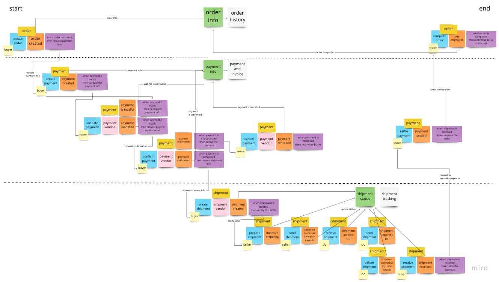

# End Point
| server          | swagger url                                                                       |
|-----------------|-----------------------------------------------------------------------------------|
| Order Command   | http://localhost:8081/swagger-ui/index.html?configUrl=/v3/api-docs/swagger-config |
| Order Query     | http://localhost:8082/swagger-ui/index.html?configUrl=/v3/api-docs/swagger-config |
| Payment Command | http://localhost:8083/swagger-ui/index.html?configUrl=/v3/api-docs/swagger-config |
| Payment Query   | http://localhost:8084/swagger-ui/index.html?configUrl=/v3/api-docs/swagger-config |

# Aggregate
order
payment
shipment

    
